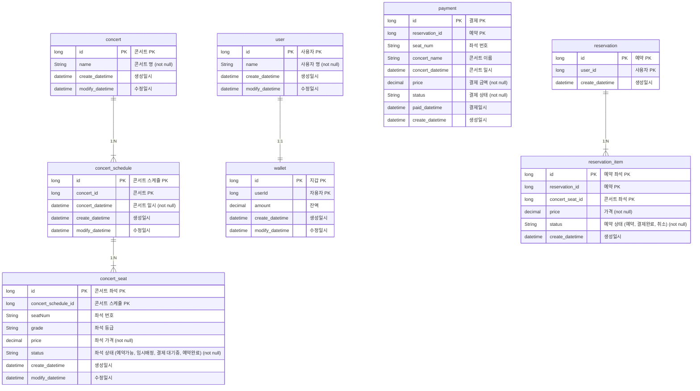
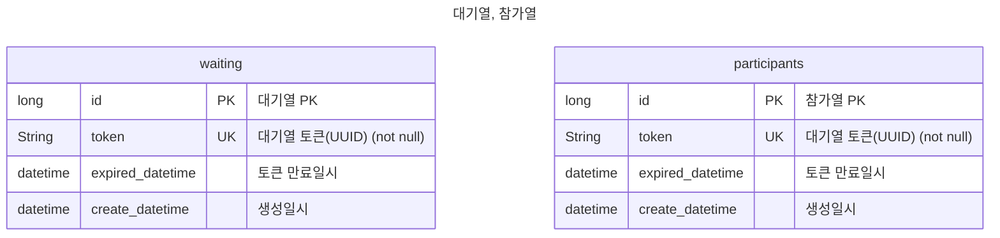

```mermaid
erDiagram
    concert ||--|{ concert_schedule: "1:N"
    concert_schedule ||--|{ concert_seat: "1:N"
    concert {
        long id PK "콘서트 PK"
        String name "콘서트 명 (not null)"
        datetime create_datetime "생성일시"
        datetime modify_datetime "수정일시"
    }
    concert_schedule {
        long id PK "콘서트 스케쥴 PK"
        long concert_id "콘서트 PK"
        datetime concert_datetime "콘서트 일시 (not null)"
        datetime create_datetime "생성일시"
        datetime modify_datetime "수정일시"
    }
    concert_seat {
        long id PK "콘서트 좌석 PK"
        long concert_schedule_id "콘서트 스케쥴 PK"
        String seatNum "좌석 번호"
        String grade "좌석 등급"
        decimal price "좌석 가격 (not null)"
        String status "좌석 상태 (예약가능, 임시배정, 결제 대기중, 예약완료) (not null)"
        datetime create_datetime "생성일시"
        datetime modify_datetime "수정일시"
    }

    user ||--|| wallet: "1:1"
    user {
        long id PK "사용자 PK"
        String name "사용자 명 (not null)"
        datetime create_datetime "생성일시"
        datetime modify_datetime "수정일시"
    }
    wallet {
    %% 추후 확장성을 고려하여 잔액에 관한 테이블을 분리 (ex. 포인트)
        long id PK "지갑 PK"
        long userId "자용자 PK"
        decimal amount "잔액"
        datetime create_datetime "생성일시"
        datetime modify_datetime "수정일시"
    }
    
    payment {
        long id PK "결제 PK"
        long reservation_id "예약 PK"
        String seat_num "좌석 번호"
        String concert_name "콘서트 이름"
        datetime concert_datetime "콘서트 일시"
        decimal price "결제 금액 (not null)"
        String status "결제 상태 (not null)"
        datetime paid_datetime "결제일시"
        datetime create_datetime "생성일시"
    }
    
    reservation ||--|{ reservation_item: "1:N"
    reservation {
        long id PK "예약 PK"
        long user_id "사용자 PK"
        datetime create_datetime "생성일시"
    }
    reservation_item {
        long id PK "예약 좌석 PK"
        long reservation_id "예약 PK"
        long concert_seat_id "콘서트 좌석 PK"
        decimal price "가격 (not null)"
        String status "예약 상태 (예약, 결제완료, 취소) (not null)"
        datetime create_datetime "생성일시"
    }
```

```mermaid
---
title: 대기열, 참가열
---
erDiagram
    waiting {
        long id PK "대기열 PK"
        String token UK "대기열 토큰(UUID) (not null)"
        datetime expired_datetime "토큰 만료일시"
        datetime create_datetime "생성일시"
    }
    participants {
        long id PK "참가열 PK"
        String token UK "대기열 토큰(UUID) (not null)"
        datetime expired_datetime "토큰 만료일시"
        datetime create_datetime "생성일시"
    }
```
