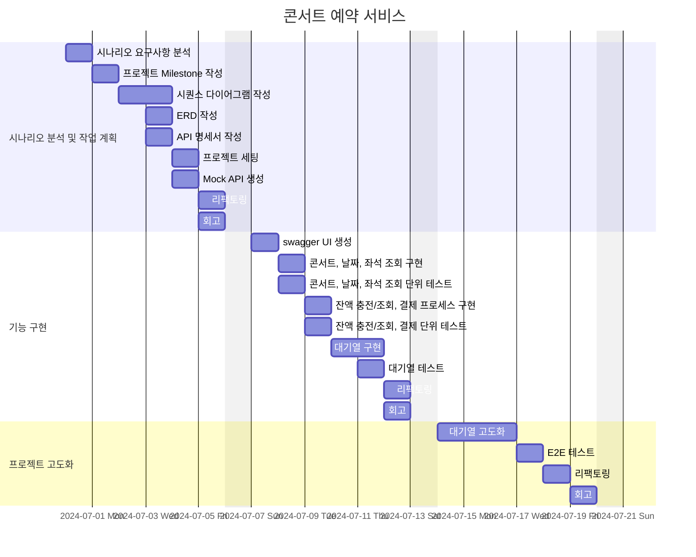

```mermaid
    gantt
        title 콘서트 예약 서비스
        axisFormat %Y-%m-%d %a
        excludes saturday
        section 시나리오 분석 및 작업 계획
            시나리오 요구사항 분석: 2024-06-30, 1d
            프로젝트 Milestone 작성: 2024-07-01, 1d
            시퀀스 다이어그램 작성: 2024-07-02, 2d
            ERD 작성: 2024-07-03, 1d
            API 명세서 작성: 2024-07-03, 1d
            프로젝트 세팅: 2024-07-04, 1d
            Mock API 생성: 2024-07-04, 1d
            리팩토링: 2024-07-05, 1d
            회고: 2024-07-05, 1d
        section 기능 구현
            swagger UI 생성: 2024-07-07, 1d
            콘서트, 날짜, 좌석 조회 구현: 2024-07-08, 1d
            콘서트, 날짜, 좌석 조회 단위 테스트: 2024-07-08, 1d
            잔액 충전/조회, 결제 프로세스 구현: 2024-07-09, 1d
            잔액 충전/조회, 결제 단위 테스트: 2024-07-09, 1d
            대기열 구현: 2024-07-10, 2d
            대기열 테스트: 2024-07-11, 1d
            리팩토링: 2024-07-12, 1d
            회고: 2024-07-12, 1d
        section 프로젝트 고도화
            대기열 고도화: 2024-07-14, 3d
            E2E 테스트: 2024-07-17, 1d
            리팩토링: 2024-07-18, 1d
            회고: 2024-07-19, 1d
```
