### 대기열 체크 API

> 대기열 체크와 토큰이 없을 경우 토큰을 발급한다.

### 대기열 토큰 만료/진입 스케쥴러

> - 프로세스 완료, 대기열 이탈 등 대기열 토큰 만료 처리
> - 주기마다 참가열의 빈 슬롯만큼 대기열을 참가열로 유입시킨다

### 콘서트 조회 API

### 날짜 조회 API

### 좌석 조회 API

### 좌석 예약 API

### 임시 배정 좌석 만료 스케쥴러

### 결제 API

```mermaid  
sequenceDiagram
    autonumber
    actor 사용자
    사용자 ->>+ 결제: 결제 요청 (결제정보)
    결제 ->>+ 좌석 예약: 유효한 좌석 체크 (좌석 배정 번호)
    좌석 예약 -->>- 결제: 유효한 좌석
    break 유효하지 않은 좌석
        결제 -->> 사용자: 결제 실패
    end
    alt 잔액 있음
        결제 ->>+ 잔액: 잔액 차감 (사용자, 결제 금액)
        잔액 -->>- 결제: 결제 성공
        결제 ->> 좌석 예약: 결제 완료 (좌석 배정 번호)
        결제 ->> 참가열: 대기열 토큰 만료 (토큰)
        결제 -->> 사용자: 예약 완료
    else 잔액 없음
        결제 ->>+ 잔액: 잔액 차감 (사용자, 결제 금액)
        잔액 -->>- 결제: 잔액 부족
        결제 -->>- 사용자: 잔액 부족
    end  
```

### 잔액 조회 API

### 잔액 충전 API

